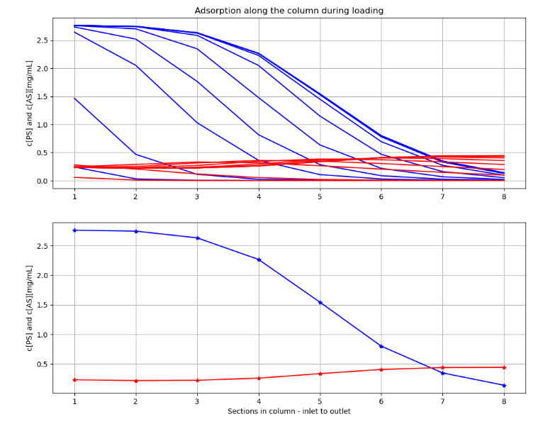

# BPL_IEC_validation

This notebook shows ion exchange chomatography. The focus is here to show that the model and simulations reproduce the original in a master thesis done in an industrial setting, see reference in the notebook. The model is briefly presented and two diagrams are reproduced. This is here counted as our Modelica-FMU model is validated. Here is no comparison with experimental data.

The column chromatography model is approximated as a series of continuous tank reactors and describe the protein binding and convection. One result is how the concentration profile along the column for two different proteins evolve over time. 
 

You see in the diagrams how the main "product" protein P (blue) and an "antagonist" protein A (red) bind to the column. 
The column is dived in 8 sections. The inlet is to the left and outlet to the right. In the upper diagram you see how the concentration profile evolve over time. In the lower diagram you see the final steady-state concentration profile.

You start up the notebook in Colab by pressing here
[start BPL notebook](https://colab.research.google.com/github/janpeter19/BPL_IEC_validation/blob/main/BPL_IEC_validation_colab.ipynb) 
or alternatively (experimentally)
[start BPL notebook with FMPy](https://github.com/janpeter19/BPL_IEC_validation/blob/main/BPL_IEC_validation_fmpy_colab.ipynb).
Then you in the menu choose Runtime/Run all. The installation of software on the remote Google server takes a few minutes. The subsequent execution of the simulations of IEC operation take just a seconds or so. 

You can continue in the notebook and make new simulations and follow the examples given. Here are many things to explore!

See also the related repository: BPL_IEC_operation.

Note that:
* The script occassionaly get stuck during installation. Then just close the notebook and start from scratch.
* Remember, you need to have a google-account!

Just to be clear, no installation is done at your local computer.

Work in progress - stay tuned!

License information:
* The binary-file with extension FMU is shared under the permissive MIT-license
* The other files are shared under the GPL 3.0 license  
